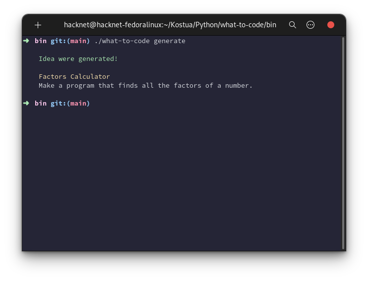
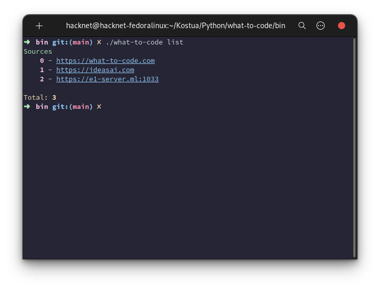

# what-to-code

Console app to generate projects ideas


## Idea sources

- [https://what-to-code.com]()
- [https://ideasai.com]()
- [https://gpt3.ethio-tech.com/]() - Mirror of chat gpt3


## Functions
```
~ what-to-code generate - Generate idea from random source
~ what-to-code generate -s 1 - Genreate idea from source 1 - ideas.ai
~ what-to-code list - Print list of sources
```

## TODO list
- [x] Base idea generation
- [x] Generate idea from custom source
- [x] Print list of sources
- [ ] Generate list of ideas from all sources && custom source (~v1.0.5)
- [ ] Saved ideas (~v2.0.0)

You can add ideas here from your for of this repo